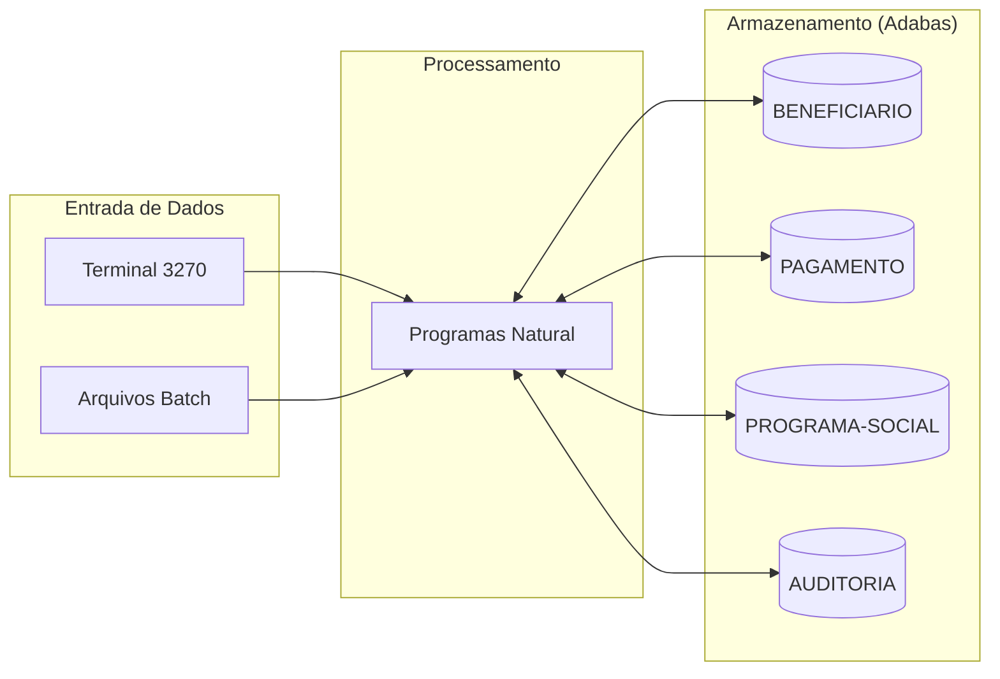

<!-- markdownlint-disable MD013 MD025 MD026 MD028 MD029 MD034 MD040 MD051 MD060 -->

# Mapa de Dependências — SIFAP Legado

  

> 🗺 **Você está aqui:** [Kit PT-BR](../README.md) → [Estágio 1](README.md) → **dependency-map**

> **Para quem é isto?** Este é um **artefato preenchido pelo time** durante o Estágio 1 (Arqueologia).
>
> **O que você terá ao final do estágio:**
>
> 1. Este documento totalmente preenchido com os dados reais do legado SIFAP
> 2. Rastreabilidade para `01-arqueologia/legado-sifap/` (programas `.NSN` e DDMs)
> 3. Base de evidência usada nas EARS do Estágio 2 (`source_legacy:`)
>
> 📘 **Guia passo a passo:** [`GUIDE.md`](GUIDE.md).

> Use diagramas Mermaid para mapear as dependências entre programas Natural e DDMs Adabas.
> O objetivo é visualizar "quem chama quem" e "quem lê/escreve o quê".

## Como descobrir dependências

- Use `grep` ou Copilot Chat para listar todas as ocorrências de `CALLNAT` nos 15 arquivos `.NSN`.
- Prompt útil: _"Liste todas as ocorrências de CALLNAT nestes arquivos e desenhe um diagrama Mermaid."_
- Para leitura/escrita em DDMs: procure por `READ`, `READ LOGICAL`, `STORE`, `UPDATE`, `DELETE`.

## Diagrama de Dependências entre Programas

> Mapa cobrindo os **15 programas Natural** organizados em 5 famílias funcionais e os **4 DDMs Adabas**.

```mermaid
flowchart TD
  subgraph Batch ["Programas Batch"]
    BATCHPGT["BATCHPGT.NSN<br/>Geração mensal de pagamentos"]
    BATCHCON["BATCHCON.NSN<br/>Conferência batch"]
    BATCHREL["BATCHREL.NSN<br/>Relatórios batch"]
  end

  subgraph Calc ["Programas de Cálculo"]
    CALCBENF["CALCBENF.NSN<br/>Cálculo de benefício"]
    CALCDSCT["CALCDSCT.NSN<br/>Cálculo de descontos"]
    CALCCORR["CALCCORR.NSN<br/>Cálculo de correção"]
  end

  subgraph Cad ["Programas de Cadastro"]
    CADBENEF["CADBENEF.NSN<br/>Cadastro de beneficiário"]
    CADPROG["CADPROG.NSN<br/>Cadastro de programa social"]
    CADDEPEND["CADDEPEND.NSN<br/>Cadastro de dependentes"]
  end

  subgraph Val ["Programas de Validação"]
    VALBENEF["VALBENEF.NSN<br/>Valida CPF/data/UF"]
    VALDOCS["VALDOCS.NSN<br/>Valida documentos"]
    VALELEG["VALELEG.NSN<br/>Valida elegibilidade"]
  end

  subgraph Rel ["Programas de Consulta/Relatório"]
    CONSBENF["CONSBENF.NSN<br/>Consulta beneficiário"]
    RELPGT["RELPGT.NSN<br/>Relatório pagamentos"]
    RELAUDIT["RELAUDIT.NSN<br/>Relatório auditoria"]
  end

  subgraph DDMs ["DDMs Adabas"]
    DDM_BENEF[("BENEFICIARIO")]
    DDM_PGTO[("PAGAMENTO")]
    DDM_PROG[("PROGRAMA-SOCIAL")]
    DDM_AUD[("AUDITORIA")]
  end

  BATCHPGT -->|CALLNAT| CALCBENF
  BATCHPGT -->|CALLNAT| CALCDSCT
  BATCHPGT -->|READ/STORE| DDM_BENEF
  BATCHPGT -->|READ/STORE| DDM_PGTO
  BATCHPGT -->|READ| DDM_PROG

  BATCHCON -->|READ| DDM_PGTO
  BATCHCON -->|READ| DDM_BENEF
  BATCHCON -->|STORE| DDM_AUD

  BATCHREL -->|READ| DDM_PGTO
  BATCHREL -->|READ| DDM_BENEF

  CALCBENF -->|READ| DDM_BENEF
  CALCBENF -->|READ| DDM_PROG
  CALCDSCT -->|READ/UPDATE| DDM_PGTO
  CALCDSCT -->|READ| DDM_BENEF
  CALCCORR -->|READ/UPDATE| DDM_PGTO
  CALCCORR -->|STORE| DDM_AUD

  CADBENEF -->|CALLNAT| VALBENEF
  CADBENEF -->|CALLNAT| VALDOCS
  CADBENEF -->|READ/STORE/UPDATE| DDM_BENEF
  CADBENEF -->|STORE| DDM_AUD
  CADPROG -->|READ/STORE/UPDATE| DDM_PROG
  CADPROG -->|STORE| DDM_AUD
  CADDEPEND -->|READ/UPDATE| DDM_BENEF

  VALBENEF -->|READ| DDM_BENEF
  VALDOCS -->|READ| DDM_BENEF
  VALELEG -->|READ| DDM_BENEF
  VALELEG -->|READ| DDM_PROG

  CONSBENF -->|READ| DDM_BENEF
  CONSBENF -->|READ| DDM_PGTO
  RELPGT -->|READ| DDM_PGTO
  RELPGT -->|READ| DDM_BENEF
  RELAUDIT -->|READ| DDM_AUD
```

> Cobertura: 15/15 programas, 4/4 DDMs, sem órfãos.

## Diagrama de Fluxo de Dados (DDMs)

> Os 4 DDMs identificados em [`legado-sifap/adabas-ddms/`](legado-sifap/adabas-ddms/): BENEFICIARIO (Arquivo 150), PAGAMENTO (Arquivo 160), PROGRAMA-SOCIAL (Arquivo 155), AUDITORIA (Arquivo 170).

## Tabela de Dependências (15 / 15 programas)

| Programa      | Chama (CALLNAT/PERFORM) | Lê (READ/FIND) DDMs                       | Escreve (STORE/UPDATE) DDMs    | Observações |
| ------------- | ----------------------- | ----------------------------------------- | ------------------------------ | ----------- |
| BATCHPGT.NSN  | CALCBENF, CALCDSCT      | BENEFICIARIO, PROGRAMA-SOCIAL, PAGAMENTO  | PAGAMENTO                      | Crítico — 1º dia útil; ordem CPF acoplada a downstream (MYS-002) |
| BATCHCON.NSN  | —                       | PAGAMENTO, BENEFICIARIO                   | AUDITORIA                      | Conferência pós-batch |
| BATCHREL.NSN  | —                       | PAGAMENTO, BENEFICIARIO                   | —                              | Relatório consolidado mensal |
| CALCBENF.NSN  | (subroutines internas)  | BENEFICIARIO, PROGRAMA-SOCIAL             | —                              | Cálculo central; chamado por BATCHPGT |
| CALCDSCT.NSN  | (subroutines internas)  | BENEFICIARIO (PE DESCONTOS), PAGAMENTO    | PAGAMENTO                      | Teto 30% exceto judicial |
| CALCCORR.NSN  | —                       | PAGAMENTO                                 | PAGAMENTO, AUDITORIA           | Correção retroativa — não analisado em profundidade (MYS-003) |
| CADBENEF.NSN  | VALBENEF, VALDOCS       | BENEFICIARIO                              | BENEFICIARIO, AUDITORIA        | Entrada manual via terminal 3270 |
| CADPROG.NSN   | —                       | PROGRAMA-SOCIAL                           | PROGRAMA-SOCIAL, AUDITORIA     | Cadastro de programas sociais |
| CADDEPEND.NSN | —                       | BENEFICIARIO                              | BENEFICIARIO                   | Atualiza NUM-DEPENDENTES (MYS-009) |
| VALBENEF.NSN  | (subroutines internas)  | BENEFICIARIO                              | —                              | CPF módulo 11, UF, data |
| VALDOCS.NSN   | —                       | BENEFICIARIO                              | —                              | Documentos do beneficiário |
| VALELEG.NSN   | —                       | BENEFICIARIO, PROGRAMA-SOCIAL             | —                              | Elegibilidade no programa |
| CONSBENF.NSN  | —                       | BENEFICIARIO, PAGAMENTO                   | —                              | Consulta online |
| RELPGT.NSN    | —                       | PAGAMENTO, BENEFICIARIO                   | —                              | Relatório de pagamentos |
| RELAUDIT.NSN  | —                       | AUDITORIA                                 | —                              | MYS-006 — lógica de auditoria não analisada |

## Dependências Circulares

Nenhuma dependência circular encontrada — todas as cadeias `CALLNAT` são acíclicas.

## Programas Órfãos / Pontos de Entrada

- **Pontos de entrada batch** (sem caller): `BATCHPGT`, `BATCHCON`, `BATCHREL` — invocados pelo scheduler do mainframe.
- **Pontos de entrada online** (sem caller): `CADBENEF`, `CADPROG`, `CADDEPEND`, `CONSBENF`, `RELPGT`, `RELAUDIT`, `CALCCORR` — invocados pelo terminal 3270.
- **Subprogramas** (chamados via CALLNAT): `VALBENEF`, `VALDOCS` (chamados por CADBENEF); `CALCBENF`, `CALCDSCT` (chamados por BATCHPGT).
- **Sem órfãos** — todos os 15 programas têm pelo menos um chamador (humano via terminal ou scheduler).

---

### Continuar a leitura

<table width="100%">
<tr>
<td width="50%" valign="top" align="left">
<strong>← ANTERIOR</strong> 
<a href="business-rules-catalog.md"><strong>business-rules-catalog.md</strong></a> 
Catálogo de regras.
</td>
<td width="50%" valign="top" align="right">
<strong>PRÓXIMO →</strong> 
<a href="discovery-report.md"><strong>discovery-report.md</strong></a> 
Síntese final.
</td>
</tr>
</table>

↑ <a href="README.md">Voltar ao Kit PT-BR</a>

