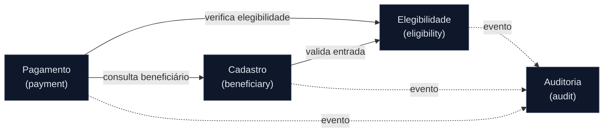

# Mapa de Bounded Contexts — SIFAP 2.0

**Time**: PT-BR Amarelo 02
**Data**: 2026-05-20

## Avaliações de Hipóteses

### Hipótese A: Um único contexto "Core" — REJEITADO

| Critério | Avaliação | Evidência |
|----------|-----------|-----------|
| Coesão | Baixa | Validações (VALBENEF) e cálculos (CALCDSCT) têm ciclos de mudança independentes |
| Acoplamento | Alto | Mudança em regra de desconto afetaria cadastro desnecessariamente |
| Frequência de mudança | Divergente | Tabelas de faixa mudam por legislação; cadastro muda por UX |

### Hipótese B: 4 contextos (Cadastro, Pagamento, Elegibilidade, Auditoria) — ACEITO

| Critério | Avaliação | Evidência |
|----------|-----------|-----------|
| Coesão | Alta | Cada contexto agrupa programas da mesma família funcional do legado |
| Acoplamento | Baixo | Comunicação via interface Java; dados não compartilhados diretamente |
| Frequência de mudança | Homogênea dentro de cada contexto | Cálculos financeiros mudam juntos; validações cadastrais mudam juntas |

### Hipótese C: 6+ contextos (separar Descontos e Batch) — REJEITADO

| Critério | Avaliação | Evidência |
|----------|-----------|-----------|
| Coesão | Boa, mas fragmentada | Descontos é sub-domínio de Pagamento — não justifica contexto próprio |
| Acoplamento | Muito baixo | Overhead de comunicação não compensado |
| Frequência de mudança | Insuficiente para justificar | Viável no futuro se o sistema crescer |

## Bounded Contexts Finais

### Cadastro (beneficiary)

- **Responsabilidade:** CRUD de beneficiários, dependentes e programas sociais
- **Dados sob ownership:** tabelas `beneficiary`, `dependent`, `social_program`
- **Interface pública:** `BeneficiaryService` (interface Java)
- **Por que é seu próprio contexto:** Programas legados CADBENEF, CADDEPEND, CADPROG formam família coesa; ciclo de mudança é UX-driven, diferente de cálculos

### Pagamento (payment)

- **Responsabilidade:** Geração de ciclo mensal, cálculo de benefício (fator regional + renda), cálculo de descontos (teto 30%, judicial, faixas), integração downstream
- **Dados sob ownership:** tabelas `payment`, `payment_cycle`, `deduction`, `regional_factor`, `income_bracket`
- **Interface pública:** `PaymentService`, `BatchCycleOrchestrator` (interfaces Java)
- **Por que é seu próprio contexto:** Programas legados BATCHPGT, CALCBENF, CALCDSCT são a cadeia crítica; mudam juntos por legislação financeira; isolamento protege contra efeitos colaterais

### Elegibilidade (eligibility)

- **Responsabilidade:** Validações de entrada (CPF, UF, nome, data nascimento), regras de corte temporal, verificação de status
- **Dados sob ownership:** tabelas de referência `valid_uf`, regras de validação
- **Interface pública:** `ValidationService` (interface Java)
- **Por que é seu próprio contexto:** Programas legados VALBENEF, VALDOCS, VALELEG são stateless validators; reutilizados por múltiplos outros contextos; ciclo de mudança é regulatório

### Auditoria (audit)

- **Responsabilidade:** Registro imutável de eventos, consulta de trilha de auditoria
- **Dados sob ownership:** tabela `audit_event` (append-only)
- **Interface pública:** `AuditEventPublisher` (interface Java — event listener)
- **Por que é seu próprio contexto:** Cross-cutting por natureza; precisa ser imutável e desacoplado; requisito regulatório separado do fluxo de negócio

## Comunicação Entre Contextos

| De | Para | Mecanismo | Dados |
|----|------|-----------|-------|
| Cadastro | Elegibilidade | Chamada síncrona (interface Java) | Dados do beneficiário para validação |
| Pagamento | Elegibilidade | Chamada síncrona (interface Java) | CPF + data de corte para verificação |
| Pagamento | Cadastro | Consulta read-only (interface Java) | Dados do beneficiário para cálculo |
| Todos | Auditoria | Evento assíncrono (Spring ApplicationEvent) | Entidade + ação + estado anterior/posterior |

---

**Definição de Pronto:** 4 contextos nomeados, hipóteses avaliadas com rejeições documentadas, Mermaid renderiza, comunicação explícita.
