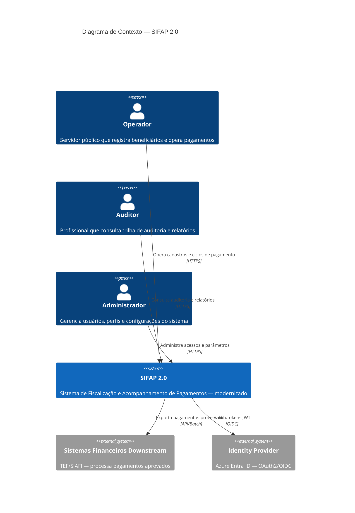

# C4 Level 1 — Diagrama de Contexto do SIFAP 2.0

## Notas

- O SIFAP 2.0 substitui o sistema legado Natural/Adabas (1997–2025).
- Sistemas downstream dependem da ordenação por CPF (BR-013) — contrato a ser formalizado.
- Identity Provider pode ser Azure Entra ID ou Keycloak local para desenvolvimento.
