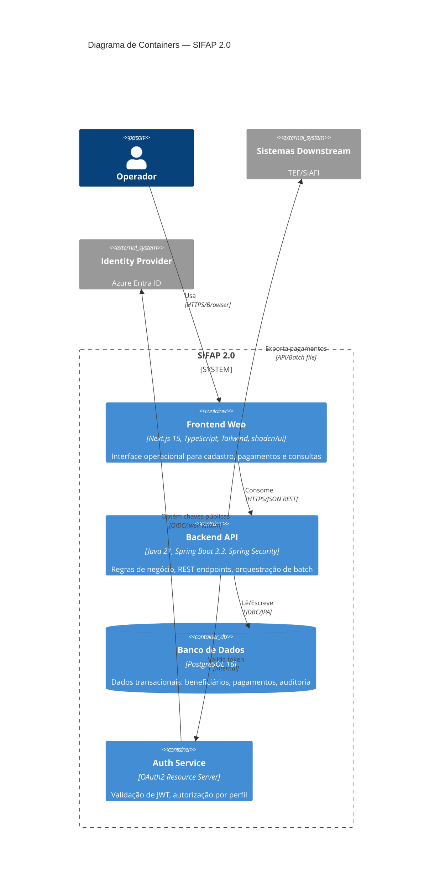

# C4 Level 2 — Diagrama de Containers do SIFAP 2.0

## Stack por Container

| Container | Tecnologia | Justificativa |
|-----------|-----------|---------------|
| Frontend | Next.js 15 App Router + TypeScript strict + Tailwind + shadcn/ui | Stack-alvo do workshop |
| Backend API | Java 21 + Spring Boot 3.3 + JPA/Hibernate | Stack-alvo do workshop |
| Banco de Dados | PostgreSQL 16 | Substituição de Adabas (ADR-002) |
| Auth | Spring Security OAuth2 Resource Server | ADR-003 |
