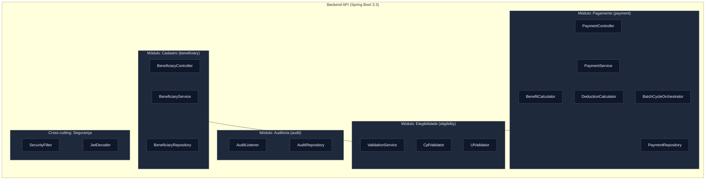

# C4 Level 3 — Diagrama de Componentes do Backend API

## Responsabilidades por Componente

| Componente | Responsabilidade | REQ-IDs |
|-----------|-----------------|---------|
| BeneficiaryController | REST CRUD beneficiários | — |
| BeneficiaryService | Lógica de cadastro | — |
| ValidationService | Orquestra validações de entrada | REQ-ELG-001 a REQ-ELG-004 |
| CpfValidator | Módulo 11 da RF | REQ-ELG-001 |
| UfValidator | Lista 27 UFs | REQ-ELG-002 |
| PaymentController | REST para ciclo e consulta | — |
| PaymentService | Orquestração de cálculo | REQ-PAY-001, REQ-PAY-002 |
| BenefitCalculator | Fator regional + fator renda | REQ-PAY-006, REQ-PAY-007 |
| DeductionCalculator | Teto 30%, judicial, faixas | REQ-PAY-008 a REQ-PAY-011 |
| BatchCycleOrchestrator | Geração mensal, ordenação, dedup | REQ-PAY-001, REQ-PAY-003 a REQ-PAY-005 |
| AuditListener | Captura eventos de domínio | REQ-AUD-001 |
| SecurityFilter | Intercepta e valida JWT | REQ-SEC-001 |
